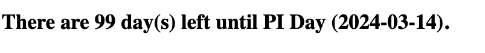
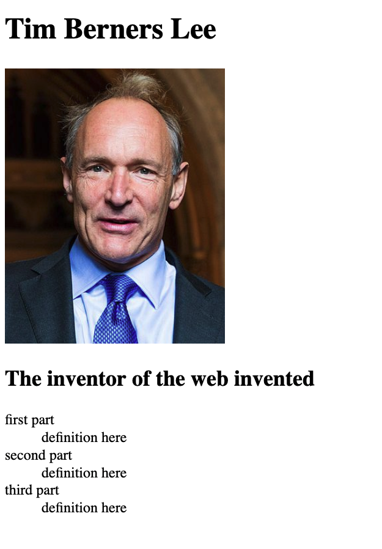
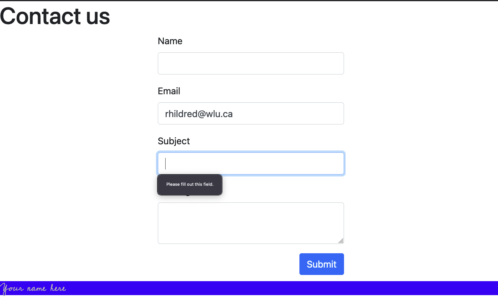

# UX220PracticeFinal
2023 practice final for UX220 with custom elements

[Edit Here](https://diy-pwa.dev/~/gh/rhildred/UX220PracticeFinal)

On the final there will be 5 questions, each worth 4 marks.

1. q1.htnl includes a document about piday. The first included custom element, logs the days left until piday. Edit this custom element to put the value in the innerHtml.
You can use the 2d included custom element as a hint.
If piday has already happened this year nDaysLeft will be negative. 
Recalculate nPiday and nDaysLeft to be the days till the next piday if nDaysLeft is negative.

Hint: Start with PiDay and get the year right. Make the same change in DaysLeft

2. Tim Berners Lee invented the worldwide web. Write an html document from scratch that includes:

    a. doctype declaration

    b. an opening and closing tag that specifies the language of the document

    c. a portion of the document that describes information about the document including the way that the viewport is scaled for mobile

    d. a portion of the document that contains the content in a main tag, including

    e. a picture of Tim Berners Lee that links to his wikipedia page and has an attribute that can be interpreted by a screen reader for this image

    f. an appropriately levelled heading

    g. a list of your choosing, containing definitions for the 3 parts of the invention.

    h. add an html 5 semantic tag at the end of the document that includes a copyright notice with a custom element for the copyright year

3. q3.html includes a twitter bootstrap contact form. Edit the form to:

    a. Add a single line (input) of text subject.

    b. Make it so that the form can't be submitted until there is something in the subject and email.

    c. in an html comment directly before the form tag describe why or why not this form will work on the internet.

    d. Make it so that the form is centred in the page.

    e. Make the submit button on the right hand side and make sure that it doesn't overlap the footer.

    f. Make the footer in a cursive font of your choosing from google fonts and with light text and a dark background of sufficient contrast.

